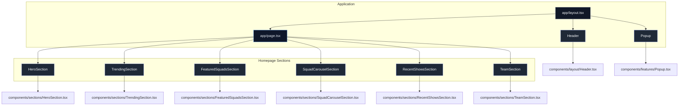

# Starclinch – Premium Talent Marketplace

[](https://nextjs.org/)
[](https://www.typescriptlang.org/)
[](https://tailwindcss.com/)
[](https://www.framer.com/motion/)

A polished frontend experience for a premium talent marketplace. Built with Next.js App Router, TypeScript, Tailwind CSS, and Framer Motion.

This repository is designed for maintainability, reusable page sections, and premium UI polish.

---

## Table of Contents

1. [Overview](#overview)
2. [Architecture](#architecture)
3. [App Flow](#app-flow)
4. [Features](#features)
5. [Tech Stack](#tech-stack)
6. [Folder Structure](#folder-structure)
7. [Getting Started](#getting-started)
8. [Scripts](#scripts)
9. [Contribution](#contribution)
10. [Notes](#notes)

---

## Overview

This repository contains the frontend implementation of a premium talent marketplace landing experience.
The app focuses on modern section composition, responsive interactions, and polished motion design.

---

## Architecture

The app is organized to separate global layout, reusable features, and homepage sections:

* `app/layout.tsx` manages global layout, metadata, fonts, and UI wrappers.
* `app/page.tsx` composes the homepage from dedicated section components.
* `components/layout/` contains layout-specific shared UI such as the header.
* `components/features/` contains reusable interactive feature components.
* `components/sections/` contains homepage section components.
* `components/index.ts` provides a centralized component barrel for cleaner imports.

This structure enables a scalable and maintainable frontend architecture.

---

## App Flow



---

## Features

* Responsive premium homepage with a polished dark interface.
* Animated sticky header with desktop dropdowns and mobile menu.
* Hero section with motion-driven typography and image transitions.
* Trending artists gallery with elegant hover interactions.
* Featured squad and storytelling carousel sections.
* Recent shows slider with smooth transitions.
* Team call-to-action section with glassmorphism styling.

---

## Tech Stack

* Next.js 16.2.3
* React 19.2.4
* TypeScript 5
* Tailwind CSS 4
* Framer Motion 12
* Lucide React
* nextjs-toploader

---

## Folder Structure

```text
starclinch/
├── app/
│   ├── layout.tsx
│   └── page.tsx
├── components/
│   ├── layout/
│   │   └── Header.tsx
│   ├── features/
│   │   ├── Popup.tsx
│   │   └── index.ts
│   ├── sections/
│   │   ├── FeaturedSquadsSection.tsx
│   │   ├── HeroSection.tsx
│   │   ├── RecentShowsSection.tsx
│   │   ├── SquadCarouselSection.tsx
│   │   ├── TeamSection.tsx
│   │   └── TrendingSection.tsx
│   └── index.ts
├── lib/
│   └── SmoothScroll.ts
├── public/
│   ├── home/
│   ├── perform/
│   └── trending/
├── package.json
├── tsconfig.json
├── next.config.ts
├── postcss.config.mjs
└── eslint.config.mjs
```

---

## Getting Started

### Prerequisites

* Node.js 20+
* npm, yarn, or pnpm installed

### Install dependencies

```bash
npm install
```

### Run locally

```bash
npm run dev
```

Open the app at `http://localhost:3000`.

---

## Scripts

* `npm run dev` — start the development server
* `npm run build` — build the production app
* `npm run start` — run the production build locally
* `npm run lint` — run the linter

---

## Contribution

1. Fork the repository.
2. Create a feature branch.
3. Keep changes isolated to components or page sections.
4. Submit a pull request with a clear summary.

---

## Notes

* This project is focused on frontend polish, animation, and responsive interaction.
* Use `components/index.ts` for centralized component exports.
* Replace placeholder links with actual deployment or demo URLs when available.
