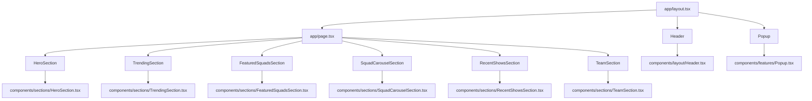

# Starclinch – Premium Talent Marketplace

[](https://nextjs.org/)
[](https://www.typescriptlang.org/)
[](https://tailwindcss.com/)
[](https://www.framer.com/motion/)

A premium frontend for Starclinch built with Next.js, TypeScript, Tailwind CSS, and Framer Motion. The application is structured for maintainability and visual polish, with reusable section components, a centralized component barrel, and a modern dark UI.

---

## Table of Contents

1. [Overview](#overview)
2. [Architecture](#architecture)
3. [Features](#features)
4. [Tech Stack](#tech-stack)
5. [Folder Structure](#folder-structure)
6. [Getting Started](#getting-started)
7. [Run Commands](#run-commands)
8. [Contribution](#contribution)

---

## Overview

This repository contains a frontend implementation of a premium talent marketplace experience. The current focus is on homepage presentation and polished UI interactions, using React components to compose hero, trending artists, squad showcases, recent shows, and team sections.

---

## Architecture

The app follows a clean, component-driven architecture:

* `app/layout.tsx` defines the global layout, default metadata, typography, and shared UI wrappers.
* `app/page.tsx` assembles the home page from dedicated section components.
* `components/` contains shared UI primitives and a barrel file (`components/index.ts`) for centralized imports.
* `components/sections/` contains the feature sections that power each homepage segment.

This structure makes it easy to extend the app with new pages or reusable sections while keeping high-level routing and layout concerns separate.

---

## App Flow



---

## Features

* Responsive dark-theme homepage with premium motion design.
* Animated header with sticky behavior, mobile menu, and dropdown navigation items.
* Hero section with rotating text, animated backgrounds, and interactive image transitions.
* Artist grid section with modern card styles and responsive hover states.
* Squad carousel and feature cards for content-rich storytelling.
* Recent shows showcase with sliding carousel interactions.
* Team call-to-action section with glassmorphism styling.

---

## Tech Stack

* Next.js 16.2.3
* React 19.2.4
* TypeScript 5
* Tailwind CSS 4
* Framer Motion 12
* Lucide React
* nextjs-toploader

---

## Folder Structure

```text
starclinch/
├── app/
│   ├── layout.tsx
│   └── page.tsx
├── components/
│   ├── layout/
│   │   └── Header.tsx
│   ├── features/
│   │   ├── Popup.tsx
│   │   └── index.ts
│   ├── sections/
│   │   ├── FeaturedSquadsSection.tsx
│   │   ├── HeroSection.tsx
│   │   ├── RecentShowsSection.tsx
│   │   ├── SquadCarouselSection.tsx
│   │   ├── TeamSection.tsx
│   │   └── TrendingSection.tsx
│   └── index.ts
├── lib/
│   └── SmoothScroll.ts
├── public/
│   ├── home/
│   ├── perform/
│   └── trending/
├── package.json
├── tsconfig.json
├── next.config.ts
├── postcss.config.mjs
└── eslint.config.mjs
```

---

## Getting Started

### Prerequisites

* Node.js 20+ recommended
* pnpm, npm, or yarn installed

### Install dependencies

```bash
npm install
```

### Start development server

```bash
npm run dev
```

Open the app at `http://localhost:3000`

---

## Run Commands

* `npm run dev` — start local development server
* `npm run build` — build the production app
* `npm run start` — run the production build locally
* `npm run lint` — run ESLint

---

## Contribution

1. Fork the repository.
2. Create a new branch for your feature or fix.
3. Open a pull request with a clear description.
4. Keep component logic isolated and reuse the section barrel when possible.

---

## Notes

* The project currently focuses on frontend experience and interface polish.
* Replace placeholder links in this README with actual demo or portfolio URLs.
* The `components/index.ts` barrel file simplifies imports across the application.
